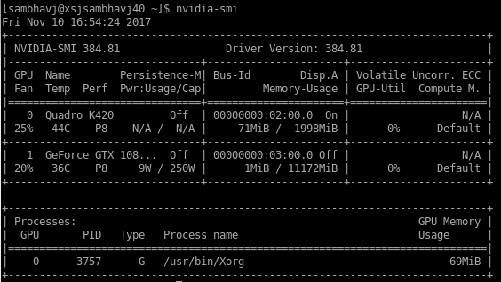

# Workstation Setup

## CUDA 9.0 toolkit installation on RHEL (includes NVIDIA CUDA drivers v384.81, toolkit and samples)
Reference:
[GTX 1080 Ti User Guide](cuda/GTX_1080_Ti_User_Guide.pdf)
[CUDA Installation Guide Linux](cuda/CUDA_Installation_Guide_Linux.pdf)

### Pre-installation steps:
1. Physically install the NVIDIA GeForce GTX 1080 Ti card on PCI Express 3.0 dual width x16 slot of motherboard and connect 6-pin and 8-pin power adaptors.

2. Verify that the system has a CUDA-capable GPU. If the GPU listed by `lspci` is listed [here](https://developer.nvidia.com/cuda-gpus), it is CUDA-capable.
```
$ update-pciids
$ lspci | grep -i nvidia
```
```
02:00.0 VGA compatible controller: NVIDIA Corporation GK107GL [Quadro K420] (rev a1)
02:00.1 Audio device: NVIDIA Corporation GK107 HDMI Audio Controller (rev a1)
03:00.0 VGA compatible controller: NVIDIA Corporation GP102 [GeForce GTX 1080 Ti] (rev a1)
03:00.1 Audio device: NVIDIA Corporation GP102 HDMI Audio Controller (rev a1)
```

3. Verify if Linux version is supported.
```
$ uname -m && cat /etc/*release
```
```
x86_64
Red Hat Enterprise Linux Workstation release 6.8 (Santiago)
```

4. Verify if gcc is installed.
```
$ gcc --version
```
```
gcc (GCC) 4.4.7 20120313 (Red Hat 4.4.7-17)
```

5. Verify the system has the correct kernel headers and development packages installed.
```
$ uname -r
```
```
2.6.32-642.el6.x86_64
```
```
$ sudo yum install kernel-devel-2.6.32-642.el6.x86_64 kernel-headers-2.6.32-642.el6.x86_64
```

### Runfile installation:
6. Download NVIDIA CUDA Toolkit from [here](https://developer.nvidia.com/cuda-downloads). Specs: Linux - x86_64 - RHEL - 6 - runfile (local). Filename: `cuda_9.0.176_384.81_linux.run`

7. Uninstall previous toolkit/driver installations to avoid conflict (not required for runfile method - see Table 2 & Table 3 [here](cuda/CUDA_Installation_Guide_Linux.pdf)). 
```
$ sudo /usr/local/cuda-X.Y/bin/uninstall_cuda_X.Y.pl
$ sudo /usr/bin/nvidia-uninstall
```

8. Disable Nouveau drivers prior to installing display drivers.
* First check if nouveau drivers are loaded:
```
$ lsmod | grep nouveau
```
* Create a file at `/etc/modprobe.d/blacklist-nouveau.conf` and add the following contents:
```
blacklist nouveau
options nouveau modeset=0
```
* Regenerate the kernel initramfs:
```
$ sudo dracut --force
```

9. Reboot into text mode (non-GUI). This is required to completely unload Nouveau drivers and prevent the graphical interface from loading.
```
$ sudo /sbin/init 3
```

10. Verify that the Nouveau drivers are not loaded.
```
$ lsmod | grep nouveau
```

11. Run installer. Follow the on-screen prompts and specify paths for installation (unless default). The openGL libraries are selected for install since the GPU used for display is also an NVIDIA GPU (Quadro K420).
```
$ sudo sh cuda_9.0.176_384.81_linux.run
```
See installation [logfile](cuda/cuda_install_4494.log).

12. Reboot the system to reload the graphical interface.

13. Verify the device nodes are created properly. Check that the device files `/dev/nvidia*` exist and have correct (0666) file permissions.

### Post-installation steps:
14. Ensure the `PATH` variable includes `/usr/local/cuda-9.0/bin` or the custom path specified during installation.
```
$ export PATH="/scratch/cuda-9.0/bin:$PATH"
```

15. Ensure the `LD_LIBRARY_PATH` includes `/usr/local/cuda-9.0/lib64` or the custom path specified during installation. Also include path to `libcupti.so` CUDA libraries.
```
$ export LD_LIBRARY_PATH="/scratch/cuda-9.0/lib64:/scratch/cuda-9.0/extras/CUPTI/lib64:$LD_LIBRARY_PATH"
```

16. Verify the NVIDIA driver version.
```
$ cat /proc/driver/nvidia/version
```
```
NVRM version: NVIDIA UNIX x86_64 Kernel Module  384.81  Sat Sep  2 02:43:11 PDT 2017
GCC version:  gcc version 4.4.7 20120313 (Red Hat 4.4.7-17) (GCC)
```

17. Verify the CUDA toolkit version.
```
$ nvcc -V
```
```
nvcc: NVIDIA (R) Cuda compiler driver
Copyright (c) 2005-2017 NVIDIA Corporation
Built on Fri_Sep__1_21:08:03_CDT_2017
Cuda compilation tools, release 9.0, V9.0.176
```

18. NVIDIA-SMI
```
$ nvida-smi
```


19. In case of two GPUs, in order to dedicate one for X display and another for CUDA compute, follow the steps listed [here](http://nvidia.custhelp.com/app/answers/detail/a_id/3029/~/using-cuda-and-x) or [PDF-1](cuda/Two_GPU_config-CUDA_Compute_and_X_Display.pdf) and [PDF-2](cuda/Two_GPU_config-StackOverflow.pdf). For instance to force GPU 1 (K420) to X Display and GPU 2 (1080 Ti) to CUDA compute, find Bus ID of K420 using `nvidia-smi -a` and add this line to `/etc/X11/xorg.conf` under 'Device' section to force K420 for X display:
```
BusID    "PCI:2:0:0"
```

20. Compile the CUDA sample programs by changing to `~/NVIDIA_CUDA-9.0_Samples` and type `make`. Run the resulting binaries from `~/NVIDIA_CUDA-9.0_Samples/bin`. Results from `deviceQuery` and `bandwidthTest` are shown below.


21. Note: If for some reason the GPU doesn't show up (ERR!) on `nvidia-smi` or isn't detected as a CUDA compatible device when running `deviceQuery`, one of the reasons is that the drivers installed by the toolkit are outdated and need to be updated. Download the latest drivers from [here](http://www.nvidia.com/Download/index.aspx?lang=en-us) and install them separately after killing GUI. E.g driver version 384.98 for Linux 64bit systems is installed.
```
$ sudo /sbin/init 3
$ sudo sh NVIDIA-Linux-x86_64-384.98.run
```
Follow the prompts to finish installation and reboot. Verify the driver version.
```
$ cat /proc/driver/nvidia/version
```
```
NVRM version: NVIDIA UNIX x86_64 Kernel Module  384.98  Thu Oct 26 15:16:01 PDT 2017
GCC version:  gcc version 4.4.7 20120313 (Red Hat 4.4.7-17) (GCC)
```

## cuDNN 7.0 installation on RHEL
Reference:
[cuDNN Installation Guide](cuda/cuDNN-Installation-Guide.pdf)

1. Download the cuDNN Tar file from [here](https://developer.nvidia.com/cudnn). File version: cuDNN v7.0.3 Linux for CUDA 9.0. Filename: 

2. Unzip the cuDNN package.
```
$ tar -xzvf cudnn-9.0-linux-x64-v7.tgz
```

3. Copy the following files to the cuda installation directory.
```
$ sudo cp cuda/include/cudnn.h /scratch/cuda-9.0/include
$ sudo cp cuda/lib64/libcudnn* /scratch/cuda-9.0/lib64
$ sudo chmod a+r /scratch/cuda-9.0/include/cudnn.h /scratch/cuda-9.0/lib64/libcudnn*
```

## Tensorflow r1.4 installation on RHEL
Reference: 
[Tensorflow Install using Binaries](https://www.tensorflow.org/versions/master/install/install_linux)
[Tensorflow Build from Source](https://www.tensorflow.org/versions/master/install/install_sources)
[Bazel Compile from Source](https://docs.bazel.build/versions/master/install-compile-source.html)

Tensorflow provides compiled pre-built binaries for only a limited systems, Ubuntu being the only Linux variant supported. Nonetheless, some RHEL users have reported successfully installing from TF / TF-GPU binaries using Anaconda (`conda install tensorflow`). I confirmed this by successfully installing TF from the pre-built linux binaries using both the virtualenv and anaconda method, but it requires older CUDA versions (CUDA 8 / cuDNN 6) to run, and there are other GLIBC dependencies that make the current RHEL system incompatible. In order to use the latest CUDA versions installed earlier (CUDA 9 / cuDNN 7), the only way out is to build TF from source [[ref](https://devtalk.nvidia.com/default/topic/1026198/cuda-9-0-importerror-libcublas-so-8-0/)].

### Prepare environment:
1. Install Python3 packages (TF requires python3-numpy, python3-pip, python3-wheel, python3-dev). Download Anaconda 5.0.1 Linux installer for Python 3.6 version from [here](https://www.anaconda.com/download/#linux) and install. Once done, add installation directory to PATH variable. Check versions of installed packages.
```
$ sudo bash ./Anaconda3-5.0.1-Linux-x86_64.sh
$ export PATH="/scratch/anaconda3/bin:$PATH"
```
```
$ python3 --version
$ pip -V
```
```
Python 3.6.3 :: Anaconda, Inc.
pip 9.0.1 from /scratch/anaconda3/lib/python3.6/site-packages (python 3.6)
```

2. Install virtualenv using pip.
```
$ sudo su -
$ pip install virtualenv
```

### Install using binaries - virtualenv method:
3. Create a virtualenv.
```
$ virtualenv --system-site-packages -p python3 /scratch/tensorflow
```
```
Running virtualenv with interpreter /scratch/anaconda3/bin/python3
Using base prefix '/scratch/anaconda3'
New python executable in /scratch/tensorflow/bin/python3
Also creating executable in /scratch/tensorflow/bin/python
Installing setuptools, pip, wheel...done.
```

4. Install TF within the virtualenv using pip.
```
$ source /scratch/tensorflow/bin/activate
(tensorflow) $ pip3 install --upgrade tensorflow-gpu
```

5. Validate the installation by running the following on python:
```
import tensorflow as tf
hello = tf.constant('Hello, TensorFlow!')
sess = tf.Session()
print(sess.run(hello))
```

TF is successfully installed, however on running python `import tensorflow as tf` it errors out: 
```
ImportError: libcublas.so.8.0: cannot open shared object file. No such file or directory.
```

So it is looking for CUDA 8, but the installed version is CUDA 9. The pre-built binaries are old and we would have to either downgrade to older CUDA/cuDNN versions to continue using this TF installation, or build TF from source [[ref](https://devtalk.nvidia.com/default/topic/1026198/cuda-9-0-importerror-libcublas-so-8-0/)].

6. Downgrade to CUDA 8 / cuDNN 6 by installing them respectively (might need to install latest CUDA drivers since the versions attached to CUDA toolkit 8 might be old) and redefining the $PATH and $LD_LIBRARY_PATH to point to this version. 

Now upon python `import tensorflow as tf` it has a new error: 
```
ImportError: /usr/lib64/libstdc++.so.6: version `GLIBCXX_3.4.19' not found (required by /scratch/tensorflow/lib/python3.6/site-packages/tensorflow/python/_pywrap_tensorflow_internal.so)
```

7. Check the available versions of GLIBC* in `/usr/lib64/libstdc++.so.6`
```
$ strings /usr/lib64/libstdc++.so.6 | grep GLIBC*
```
```
GLIBCXX_3.4
GLIBCXX_3.4.1
GLIBCXX_3.4.2
GLIBCXX_3.4.3
GLIBCXX_3.4.4
GLIBCXX_3.4.5
GLIBCXX_3.4.6
GLIBCXX_3.4.7
GLIBCXX_3.4.8
GLIBCXX_3.4.9
GLIBCXX_3.4.10
GLIBCXX_3.4.11
GLIBCXX_3.4.12
GLIBCXX_3.4.13
GLIBC_2.2.5
GLIBC_2.3
GLIBC_2.4
GLIBC_2.3.2
```

The pre-built TF binary has a hard dependency on `GLIBCXX_3.4.19` which isn't present in `/usr/lib64/libstdc++.so.6` but is present in `/scratch/anaconda3/lib/libstdc++.so.6`.
```
$ strings /scratch/anaconda3/lib/libstdc++.so.6 | grep GLIBC*
```
```
GLIBCXX_3.4
GLIBCXX_3.4.1
GLIBCXX_3.4.2
GLIBCXX_3.4.3
GLIBCXX_3.4.4
GLIBCXX_3.4.5
GLIBCXX_3.4.6
GLIBCXX_3.4.7
GLIBCXX_3.4.8
GLIBCXX_3.4.9
GLIBCXX_3.4.10
GLIBCXX_3.4.11
GLIBCXX_3.4.12
GLIBCXX_3.4.13
GLIBCXX_3.4.14
GLIBCXX_3.4.15
GLIBCXX_3.4.16
GLIBCXX_3.4.17
GLIBCXX_3.4.18
GLIBCXX_3.4.19
GLIBCXX_3.4.20
GLIBCXX_3.4.21
GLIBCXX_3.4.22
GLIBCXX_3.4.23
GLIBCXX_3.4.24
GLIBC_2.3
GLIBC_2.2.5
GLIBC_2.3.2
```

To pick the `glibcxx` from the newer Anaconda env, try to next install TF using anaconda method.

### Install using binaries - anaconda method:
3. Since Anaconda was already installed in the previous steps, simply create a new conda env named `tensorflow` as follows.
```
$ conda create -n tensorflow pip python=3.6
```

4. Activate the conda env.
```
$ source activate tensorflow
```

5. Install TF inside the conda env.
```
(tensorflow) $ pip install --ignore-installed --upgrade https://storage.googleapis.com/tensorflow/linux/gpu/tensorflow_gpu-1.4.0-cp36-cp36m-linux_x86_64.whl
```

6. Validate the installation as done previously. Upon running python `import tensorflow as tf` there is a new error.
```
ImportError: /lib64/libc.so.6: version `GLIBC_2.16' not found (required by /home/sambhavj/.conda/envs/tensorflow/lib/python3.6//tensorflow/python/_pywrap_tensorflow_internal.so)
```
```
$ strings /lib64/libc.so.6 | grep GLIBC*
```
```
GLIBC_2.2.5
GLIBC_2.2.6
GLIBC_2.3
GLIBC_2.3.2
GLIBC_2.3.3
GLIBC_2.3.4
GLIBC_2.4
GLIBC_2.5
GLIBC_2.6
GLIBC_2.7
GLIBC_2.8
GLIBC_2.9
GLIBC_2.10
GLIBC_2.11
GLIBC_2.12
```
```
$ ldd --version
```
```
ldd (GNU libc) 2.12
```

Current version is `GLIBC_2.12`, but the installation requires `GLIBC_2.16`. This is much harder to fix, and often requires upgrade of OS/kernels. Installing a separate version of `glibc` and including in `LD_LIBRARY_PATH` is not recommended as it can affect shell usage and render the machine unusable.

### Build from source:
3. Clone TF repository.
```
$ git clone https://github.com/tensorflow/tensorflow
$ cd tensorflow
$ git checkout r1.4
```

4. Install JDK8 dependency (for Bazel).
```
$ sudo yum install java-1.8.0-openjdk-devel.x86_64 java-1.8.0-openjdk-headless.x86_64
```

5. Install Bazel. Download Bazel 0.7.0 distribution archive from [here](https://github.com/bazelbuild/bazel/releases) and unzip.
```
$ unzip bazel-0.7.0-dist.zip
$ sudo bash compile.sh
./bazel-0.7.0-without-jdk-installer-linux-x86_64.sh --prefix=/scratch/bazel
```
Bazel build from source issue:
https://github.com/bazelbuild/bazel/issues/760


Bazel issue with RHEL6: 
https://github.com/bazelbuild/bazel/issues/50
https://github.com/bazelbuild/bazel/issues/4032

glibc version 2.12, but expects 2.14. Build from source also has an issue.

Fix: CROSSTOOL :
http://biophysics.med.jhmi.edu/~yliu120/tensorflow.html

https://github.com/tensorflow/tensorflow/issues/110
https://github.com/tensorflow/tensorflow/issues/527
https://github.com/bazelbuild/bazel/issues/583
http://thelazylog.com/install-tensorflow-with-gpu-support-on-sandbox-redhat/

Install another glibc version:
https://stackoverflow.com/questions/33655731/error-while-importing-tensorflow-in-python2-7-in-ubuntu-12-04-glibc-2-17-not-f/34900471#34900471
https://stackoverflow.com/questions/35616650/how-to-upgrade-glibc-from-version-2-12-to-2-14-on-centos
