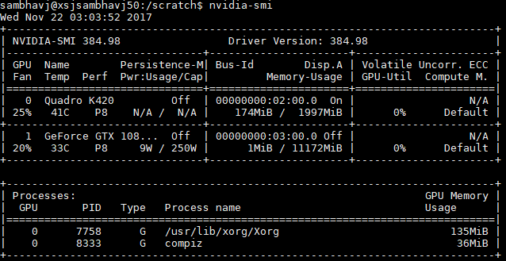
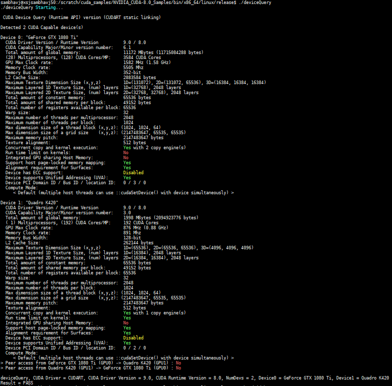
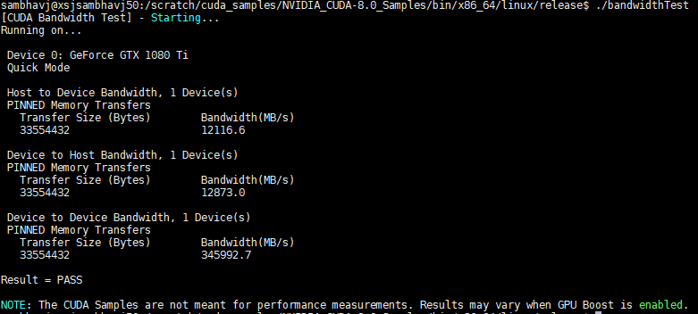

# Ubuntu Workstation Setup for Training Neural Networks

Unlike the setup for [RHEL](RHEL_README.md), this is much simpler as we directly install from prebuilt binaries for standard Ubuntu release. Here is the final configuration of the working setup.
```
Ubuntu 16.04.3 LTS (Xenial Xerus)
CUDA 8.0
cuDNN 6.0
python 3.5.2 (default with Ubuntu)
gcc 5.4.0 (default with Ubuntu)
bazel 0.5.4 (installed from binary)
tensorflow-gpu r1.4 (pip installed from binary)
keras 2.1.1 (pip installed from binary)
pytorch 0.2.0 (pip installed from binary)
torchvision 0.1.9 (pip installed from binary)
jupyter 4.4.0 (pip installed from binary)
```

## CUDA 8.0 toolkit installation on Ubuntu

Reference:
[GTX 1080 Ti User Guide](cuda/GTX_1080_Ti_User_Guide.pdf)
[CUDA Installation Guide Linux](cuda/CUDA_Installation_Guide_Linux.pdf)

### CUDA Pre-installation steps

Physically install the NVIDIA GeForce GTX 1080 Ti card on PCI Express 3.0 dual width x16 slot of motherboard and connect 6-pin and 8-pin power adaptors. Verify that the system has a CUDA-capable GPU. If the GPU listed by `lspci` is listed [here](https://developer.nvidia.com/cuda-gpus), it is CUDA-capable.
```
$ sudo update-pciids
$ lspci | grep -i nvidia

02:00.0 VGA compatible controller: NVIDIA Corporation GK107GL [Quadro K420] (rev a1)
02:00.1 Audio device: NVIDIA Corporation GK107 HDMI Audio Controller (rev a1)
03:00.0 VGA compatible controller: NVIDIA Corporation GP102 [GeForce GTX 1080 Ti] (rev a1)
03:00.1 Audio device: NVIDIA Corporation GP102 HDMI Audio Controller (rev a1)
```

Verify if Linux version is supported.
```
$ uname -m && cat /etc/*release

x86_64
DISTRIB_ID=Ubuntu
DISTRIB_RELEASE=16.04
DISTRIB_CODENAME=xenial
DISTRIB_DESCRIPTION="Ubuntu 16.04.3 LTS"
```

Verify if gcc is installed.
```
$ gcc --version
gcc (Ubuntu 5.4.0-6ubuntu1~16.04.5) 5.4.0 20160609
```

Verify the system has the correct kernel headers and development packages installed.
```
$ uname -r
4.4.0-101-generic

$ sudo apt-get install linux-headers-4.4.0-101-generic
Reading package lists... Done
Building dependency tree
Reading state information... Done
linux-headers-4.4.0-101-generic is already the newest version (4.4.0-101.124).
```

### CUDA Runfile installation
Download NVIDIA CUDA Toolkit 8.0 GA2 from [here](https://developer.nvidia.com/cuda-80-ga2-download-archive). Specs: Linux -> x86_64 -> Ubuntu -> 16.04 -> runfile (local). Filenames: `cuda_8.0.61_375.26_linux.run` (base installer) and `cuda_8.0.61.2_linux.run` (patch). Since the default NVIDIA drivers in this toolkit are old, also download the latest drivers (v384.98, released 2017.11.2) from [here](http://www.nvidia.com/Download/index.aspx). Specs: GeForce -> GeForce 10 -> GeForce GTX 1080 Ti -> Linux 64-bit.
```
$ wget https://developer.nvidia.com/compute/cuda/8.0/Prod2/local_installers/cuda_8.0.61_375.26_linux-run -P /scratch/setup/cuda
$ wget https://developer.nvidia.com/compute/cuda/8.0/Prod2/patches/2/cuda_8.0.61.2_linux-run -P /scratch/setup/cuda
$ wget http://us.download.nvidia.com/XFree86/Linux-x86_64/384.98/NVIDIA-Linux-x86_64-384.98.run -P /scratch/setup/cuda
```

Uninstall previous toolkit/driver installations to avoid conflict (not required for runfile method - see Table 2 & Table 3 [here](cuda/CUDA_Installation_Guide_Linux.pdf)).
```
$ sudo /usr/local/cuda-X.Y/bin/uninstall_cuda_X.Y.pl
$ sudo /usr/bin/nvidia-uninstall
```

Disable Nouveau drivers prior to installing display drivers. First check if nouveau drivers are loaded.
```
$ lsmod | grep nouveau

nouveau              1495040  3
mxm_wmi                16384  1 nouveau
video                  40960  1 nouveau
i2c_algo_bit           16384  1 nouveau
ttm                    98304  1 nouveau
drm_kms_helper        155648  1 nouveau
drm                   364544  6 ttm,drm_kms_helper,nouveau
wmi                    20480  2 mxm_wmi,nouveau
```

Create a file at `/etc/modprobe.d/blacklist-nouveau.conf` and add the following contents.
```
blacklist nouveau
options nouveau modeset=0
```

Regenerate the kernel initramfs and reboot.
```
$ sudo update-initramfs -u
$ reboot
```

Verify that the Nouveau drivers are not loaded.
```
$ lsmod | grep nouveau
```

Switch to terminal mode (tty1) by pressing `CTRL+ALT+F1` [[ref](http://ubuntuhandbook.org/index.php/2014/01/boot-into-text-console-ubuntu-linux-14-04/)], then kill GUI X-server (lightdm).
```
$ sudo service lightdm stop
```

Run installer and patch. Follow the on-screen prompts and specify paths for installation (unless default). The openGL libraries are selected for install since the GPU used for display is also an NVIDIA GPU (Quadro K420). Finally install NVIDIA driver v384.98.
```
$ sudo sh cuda_8.0.61_375.26_linux-run
$ sudo sh cuda_8.0.61.2_linux-run
$ sudo sh NVIDIA-Linux-x86_64-384.98.run
```

Re-enable GUI and switch to GUI (tty7) by pressing `CTRL+ALT+F7`. Reboot the system to reload the graphical interface. Verify the device nodes are created properly. Check that the device files `/dev/nvidia*` exist and have correct (0666) file permissions.
```
$ sudo service lightdm start
$ reboot
```

### CUDA Post-installation steps
Ensure the `PATH` variable includes `/usr/local/cuda-8.0/bin` or the custom path specified during installation. Ensure the `LD_LIBRARY_PATH` includes `/usr/local/cuda-8.0/lib64` or the custom path specified during installation. Also include path to `libcupti.so` CUDA libraries.
```
$ export PATH="/scratch/cuda-8.0/bin:$PATH"
$ export LD_LIBRARY_PATH="/scratch/cuda-8.0/lib64:/scratch/cuda-8.0/extras/CUPTI/lib64:$LD_LIBRARY_PATH"
```

Verify the NVIDIA driver version.
```
$ cat /proc/driver/nvidia/version

NVRM version: NVIDIA UNIX x86_64 Kernel Module  384.98  Thu Oct 26 15:16:01 PDT 2017
GCC version:  gcc version 5.4.0 20160609 (Ubuntu 5.4.0-6ubuntu1~16.04.5)
```

Verify the CUDA toolkit version.
```
$ nvcc -V

nvcc: NVIDIA (R) Cuda compiler driver
Copyright (c) 2005-2016 NVIDIA Corporation
Built on Tue_Jan_10_13:22:03_CST_2017
Cuda compilation tools, release 8.0, V8.0.61
```

NVIDIA-SMI
```
$ nvidia-smi
```


In case of two GPUs, in order to dedicate one for X display and another for CUDA compute, follow the steps listed [here](http://nvidia.custhelp.com/app/answers/detail/a_id/3029/~/using-cuda-and-x) or [PDF-1](cuda/Two_GPU_config-CUDA_Compute_and_X_Display.pdf) and [PDF-2](cuda/Two_GPU_config-StackOverflow.pdf). For instance to force GPU 1 (K420) to X Display and GPU 2 (1080 Ti) to CUDA compute, find Bus ID of K420 using `nvidia-smi -a` and add this line to `/etc/X11/xorg.conf` under 'Device' section to force K420 for X display.
```
BusID    "PCI:2:0:0"
```

Compile the CUDA sample programs by changing to `~/NVIDIA_CUDA-8.0_Samples` and type `make`. Run the resulting binaries from `~/NVIDIA_CUDA-8.0_Samples/bin`. Results from `deviceQuery` and `bandwidthTest` are shown below.




## cuDNN 6.0 installation on Ubuntu

Reference:
[cuDNN Installation Guide](cuda/cuDNN-Installation-Guide.pdf)

Download the cuDNN Tar file from [here](https://developer.nvidia.com/cudnn). File version: cuDNN v6.0 Linux for CUDA 8.0. Filename: `cudnn-8.0-linux-x64-v6.0.tgz`. Unzip the cuDNN package.
```
$ tar -xzvf cudnn-8.0-linux-x64-v6.0.tgz
```

Copy the following files to the cuda installation directory.
```
$ sudo cp cuda/include/cudnn.h /scratch/cuda-8.0/include/
$ sudo cp cuda/lib64/libcudnn* /scratch/cuda-8.0/lib64/
$ sudo chmod a+r /scratch/cuda-8.0/include/cudnn.h /scratch/cuda-8.0/lib64/libcudnn*
```

## Bazel 0.5.4 installation on Ubuntu

Reference: 
[Bazel Install using Binaries](https://docs.bazel.build/versions/master/install-ubuntu.html#install-with-installer-ubuntu) [[pdf](tensorflow/Installing_Bazel_on_Ubuntu.pdf)]

Install dependencies.
```
$ sudo apt-get install pkg-config zip g++ zlib1g-dev unzip python
```

Download the bazel 0.5.4 binary installer for linux including JDK 8 from [here](https://github.com/bazelbuild/bazel/releases/tag/0.5.4). Run the installer.
```
$ wget https://github.com/bazelbuild/bazel/releases/download/0.5.4/bazel-0.5.4-installer-linux-x86_64.sh
$ chmod +x bazel-<version>-installer-linux-x86_64.sh
$ ./bazel-0.5.4-installer-linux-x86_64.sh --prefix=/scratch/bazel
```

Add `/scratch/bazel/bin` to the `PATH`.
```
$ export PATH="/scratch/bazel/bin:$PATH"
```

## Tensorflow r1.4 / Keras 2.1.1 installation on Ubuntu

Reference:
[Tensorflow Install using Binaries](https://www.tensorflow.org/versions/master/install/install_linux) [[pdf](tensorflow/Installing_TensorFlow_on_Ubuntu.pdf)]

Install pip and virtualenv.
```
$ sudo apt-get install python3-pip python3-dev python-virtualenv
$ sudo apt-get install virtualenv
```

Create a virtualenv and activate it.
```
$ virtualenv --system-site-packages -p python3 /scratch/tensorflow
$ source /scratch/tensorflow/bin/activate
```

Install tensorflow-gpu within the virtualenv.
```
(tensorflow) $ pip3 install --upgrade tensorflow-gpu

Collecting tensorflow-gpu
  Downloading tensorflow_gpu-1.4.0-cp35-cp35m-manylinux1_x86_64.whl (170.1MB)
    100% |████████████████████████████████| 170.1MB 10kB/s
Collecting tensorflow-tensorboard<0.5.0,>=0.4.0rc1 (from tensorflow-gpu)
  Downloading tensorflow_tensorboard-0.4.0rc3-py3-none-any.whl (1.7MB)
    100% |████████████████████████████████| 1.7MB 522kB/s
Collecting numpy>=1.12.1 (from tensorflow-gpu)
  Downloading numpy-1.13.3-cp35-cp35m-manylinux1_x86_64.whl (16.9MB)
    100% |████████████████████████████████| 16.9MB 88kB/s
Requirement already up-to-date: wheel>=0.26 in ./tensorflow/lib/python3.5/site-packages (from tensorflow-gpu)
Collecting protobuf>=3.3.0 (from tensorflow-gpu)
  Downloading protobuf-3.5.0-cp35-cp35m-manylinux1_x86_64.whl (6.4MB)
    100% |████████████████████████████████| 6.4MB 196kB/s
Collecting enum34>=1.1.6 (from tensorflow-gpu)
  Using cached enum34-1.1.6-py3-none-any.whl
Collecting six>=1.10.0 (from tensorflow-gpu)
  Using cached six-1.11.0-py2.py3-none-any.whl
Collecting bleach==1.5.0 (from tensorflow-tensorboard<0.5.0,>=0.4.0rc1->tensorflow-gpu)
  Using cached bleach-1.5.0-py2.py3-none-any.whl
Collecting werkzeug>=0.11.10 (from tensorflow-tensorboard<0.5.0,>=0.4.0rc1->tensorflow-gpu)
  Using cached Werkzeug-0.12.2-py2.py3-none-any.whl
Collecting markdown>=2.6.8 (from tensorflow-tensorboard<0.5.0,>=0.4.0rc1->tensorflow-gpu)
  Using cached Markdown-2.6.9.tar.gz
Collecting html5lib==0.9999999 (from tensorflow-tensorboard<0.5.0,>=0.4.0rc1->tensorflow-gpu)
  Using cached html5lib-0.9999999.tar.gz
Requirement already up-to-date: setuptools in ./tensorflow/lib/python3.5/site-packages (from protobuf>=3.3.0->tensorflow-gpu)
Building wheels for collected packages: markdown, html5lib
  Running setup.py bdist_wheel for markdown ... done
  Stored in directory: /home/sambhavj/.cache/pip/wheels/bf/46/10/c93e17ae86ae3b3a919c7b39dad3b5ccf09aeb066419e5c1e5
  Running setup.py bdist_wheel for html5lib ... done
  Stored in directory: /home/sambhavj/.cache/pip/wheels/6f/85/6c/56b8e1292c6214c4eb73b9dda50f53e8e977bf65989373c962
Successfully built markdown html5lib
Installing collected packages: six, html5lib, bleach, werkzeug, markdown, protobuf, numpy, tensorflow-tensorboard, enum34, tensorflow-gpu
  Found existing installation: six 1.10.0
    Not uninstalling six at /usr/lib/python3/dist-packages, outside environment /scratch/tensorflow
  Found existing installation: html5lib 0.999
    Not uninstalling html5lib at /usr/lib/python3/dist-packages, outside environment /scratch/tensorflow
Successfully installed bleach-1.5.0 enum34-1.1.6 html5lib-0.9999999 markdown-2.6.9 numpy-1.13.3 protobuf-3.5.0 six-1.11.0 tensorflow-gpu-1.4.0 tensorflow-tensorboard-0.4.0rc3 werkzeug-0.12.2
```

Install Keras within the same virtualenv (Note: Keras is included with Tensorflow v1.1 and up by default, hence this step is not required)
```
(tensorflow) $ pip3 install keras

Collecting keras
  Downloading Keras-2.1.1-py2.py3-none-any.whl (302kB)
    100% |████████████████████████████████| 307kB 1.2MB/s
Collecting pyyaml (from keras)
  Downloading PyYAML-3.12.tar.gz (253kB)
    100% |████████████████████████████████| 256kB 1.2MB/s
Requirement already satisfied: numpy>=1.9.1 in ./tensorflow/lib/python3.5/site-packages (from keras)
Requirement already satisfied: six>=1.9.0 in ./tensorflow/lib/python3.5/site-packages (from keras)
Collecting scipy>=0.14 (from keras)
  Downloading scipy-1.0.0-cp35-cp35m-manylinux1_x86_64.whl (49.6MB)
    100% |████████████████████████████████| 49.6MB 34kB/s
Building wheels for collected packages: pyyaml
  Running setup.py bdist_wheel for pyyaml ... done
  Stored in directory: /home/sambhavj/.cache/pip/wheels/2c/f7/79/13f3a12cd723892437c0cfbde1230ab4d82947ff7b3839a4fc
Successfully built pyyaml
Installing collected packages: pyyaml, scipy, keras
Successfully installed keras-2.1.1 pyyaml-3.12 scipy-1.0.0
```

Validate the installation by running the following in python within the virtualenv.
```
import tensorflow as tf
hello = tf.constant('Hello, TensorFlow!')
sess = tf.Session()
print(sess.run(hello))

b'Hello, TensorFlow!'
```

## PyTorch 0.2.0 installation on Ubuntu

Create a virtualenv and activate it.
```
$ virtualenv --system-site-packages -p python3 /scratch/pytorch
$ source /scratch/pytorch/bin/activate
```

Install pytorch within the virtualenv.
```
(pytorch) $ pip3 install http://download.pytorch.org/whl/cu80/torch-0.2.0.post3-cp35-cp35m-manylinux1_x86_64.whl

Collecting torch==0.2.0.post3 from http://download.pytorch.org/whl/cu80/torch-0.2.0.post3-cp35-cp35m-manylinux1_x86_64.whl
  Downloading http://download.pytorch.org/whl/cu80/torch-0.2.0.post3-cp35-cp35m-manylinux1_x86_64.whl (486.7MB)
    100% |████████████████████████████████| 486.7MB 8.3MB/s
Collecting pyyaml (from torch==0.2.0.post3)
Collecting numpy (from torch==0.2.0.post3)
  Using cached numpy-1.13.3-cp35-cp35m-manylinux1_x86_64.whl
Installing collected packages: pyyaml, numpy, torch
Successfully installed numpy-1.13.3 pyyaml-3.12 torch-0.2.0.post3
```

Install torchvision within the virtualenv.
```
(pytorch) $ pip3 install torchvision

Collecting torchvision
  Downloading torchvision-0.1.9-py2.py3-none-any.whl (43kB)
    100% |████████████████████████████████| 51kB 1.3MB/s
Requirement already satisfied: six in /usr/lib/python3/dist-packages (from torchvision)
Requirement already satisfied: numpy in ./pytorch/lib/python3.5/site-packages (from torchvision)
Requirement already satisfied: pillow in /usr/lib/python3/dist-packages (from torchvision)
Requirement already satisfied: torch in ./pytorch/lib/python3.5/site-packages (from torchvision)
Requirement already satisfied: pyyaml in ./pytorch/lib/python3.5/site-packages (from torch->torchvision)
Installing collected packages: torchvision
Successfully installed torchvision-0.1.9
```

## Jupyter / IPython notebook config
Install jupyter from within the virtualenv, and generate config file.
```
(pytorch) $ pip3 install jupyter
(pytorch) $ jupyter notebook --generate-config
```

Add the following to `~/.jupyter/jupyter_notebook_config.py`.
```
c = get_config()
c.NotebookApp.ip = '*'
c.NotebookApp.open_browser = False
c.NotebookApp.port = 7000
c.NotebookApp.iopub_data_rate_limit = 10000000
```

Start jupyter notebook server from the diretory containing `.ipynb` notebooks.
```
(pytorch) $ jupyter-notebook --no-browser --port=7000

[W 20:31:47.674 NotebookApp] WARNING: The notebook server is listening on all IP addresses and not using encryption. This is not recommended.
[I 20:31:47.680 NotebookApp] Serving notebooks from local directory: /data/proj/
[I 20:31:47.680 NotebookApp] 0 active kernels
[I 20:31:47.680 NotebookApp] The Jupyter Notebook is running at:
[I 20:31:47.681 NotebookApp] http://[all ip addresses on your system]:7000/?token=36e1b811e3e12dda097fea55ca3b204b71eee76153153a57
[I 20:31:47.681 NotebookApp] Use Control-C to stop this server and shut down all kernels (twice to skip confirmation).
[C 20:31:47.681 NotebookApp]

    Copy/paste this URL into your browser when you connect for the first time,
    to login with a token:
        http://localhost:7000/?token=36e1b811e3e12dda097fea55ca3b204b71eee76153153a57
```

Run the notebook URL from a local browser, replacing `localhost` with the IP address of the host (`hostname -I` or `hostname -A`). Enter the token ID if prompted.
```
http://172.19.74.31:7000
```

Done.

